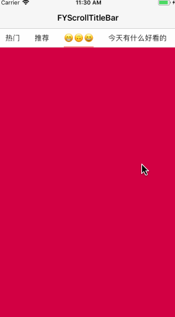

# FYScrollTitleBar

关于
===
>公司项目新版本上线,做一下总结,封装了首页标题视图,适用于主流新闻客户端滚动标题栏

### 效果图
   

使用
===

1.初始化
--------------------------
    /**
    *  @param frame frame
    *  @param titles 标题数组
    *  @param delegate 代理
    */
    + (instancetype)titleBarWithFrame:(CGRect)frame titles:(NSArray<NSString *> *)titles delegate:(id<FYScrollTitleBarDelegate>)delegate;
    + (instancetype)titleBarWithFrame:(CGRect)frame titles:(NSArray<NSString *> *)titles;

2.属性
--------------------------
    /// 底部红色指示条
    @property (nonatomic, strong) UIImageView *indicator;
    /// 所有 button 的父视图
    @property (nonatomic, strong) UIScrollView *contentView;
    /// 顶部灰色线条
    @property (nonatomic, strong) UIImageView *topLine;
    /// 底部灰色线条
    @property (nonatomic, strong) UIImageView *bottomLine;
    /// 当前选中的 button
    @property (nonatomic, strong) UIButton *selectedButton;
    /// 所有titles
    @property (nonatomic, strong) NSArray<NSString *> *titles;
    /// 当前选中 button 的index
    @property (nonatomic, assign, readonly) NSInteger selectedIndex;
    /// 代理
    @property (nonatomic, weak) id<FYScrollTitleBarDelegate> delegate;
    /// 自己更新 Indicator 位置, 默认为NO
    @property (nonatomic, assign) BOOL automicAdjustIndicator;

3.方法(具体效果看 demo)
--------------------------
    /// 滚动条更新
    - (void)updatePercentX:(CGFloat)precentX;
    /// 更新选中的 button
    - (void)setSelectedButtonAtIndex:(NSInteger)index;

4.代理
--------------------------
    /**
    *  当前选中的 button 的索引回调
    */
    - (void)titleBar:(FYScrollTitleBar *)titleBar didSelectedIndex:(NSInteger)index;

